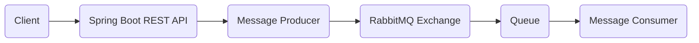
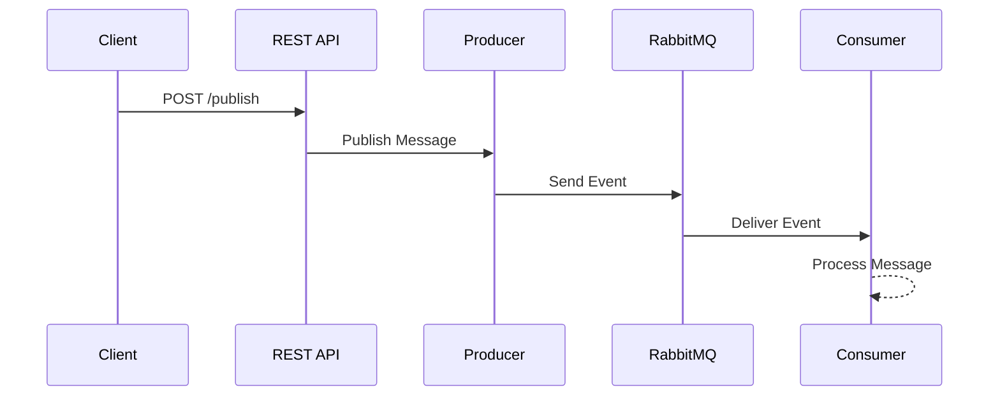

<div align="center">

# Spring Boot RabbitMQ Server


<br>

[](https://openjdk.org/)
[](https://spring.io/projects/spring-boot)
[](https://www.rabbitmq.com/)
[](https://maven.apache.org/)
[]()

---

### Production-ready Spring Boot application demonstrating asynchronous messaging using RabbitMQ and Event-Driven Architecture.

</div>

---

# Overview

This project demonstrates how distributed applications communicate asynchronously using **RabbitMQ**.

Instead of tightly coupling services, the application publishes messages to RabbitMQ where consumers process them independently. This architecture improves scalability, resiliency, and overall system performance.

---

# Features

- Spring Boot
- RabbitMQ Producer
- RabbitMQ Consumer
- Asynchronous Message Processing
- REST APIs
- Event-Driven Architecture

---

# Tech Stack

Java 21 -> Programming Language
Spring Boot -> Backend Framework
RabbitMQ -> Message Broker
Spring AMQP -> RabbitMQ Integration
REST API -> API Layer
Maven -> Dependency Management

---

# 🏛Architecture



---

# 🔄 Message Flow



---

# Project Structure

```
springboot-rabbitmq-server
│
├── src
│   ├── main
│   │   ├── java
│   │   │   ├── config
│   │   │   ├── controller
│   │   │   ├── producer
│   │   │   ├── consumer
│   │   │   ├── dto
│   │   │   └── SpringbootRabbitmqApplication.java
│   │   │
│   │   └── resources
│   │       └── application.properties
│   │
│   └── test
│
├── pom.xml
└── README.md
```

---

# Getting Started

## Clone Repository

```bash
git clone https://github.com/sonaltamse/rabbitmq-event-processor.git

cd rabbitmq-event-processor
```

---

## Start RabbitMQ

Using Docker

```bash
docker run -d \
--hostname rabbitmq \
--name rabbitmq \
-p 5672:5672 \
-p 15672:15672 \
rabbitmq:3-management
```

RabbitMQ Dashboard

```
http://localhost:15672
```

Default Credentials

```
Username : guest
Password : guest
```

---

## Run the Project

```bash
mvn spring-boot:run
```

or

```bash
./mvnw spring-boot:run
```

---

# ⚙ Configuration

```properties
spring.rabbitmq.host=localhost
spring.rabbitmq.port=5672
spring.rabbitmq.username=guest
spring.rabbitmq.password=guest
```
---

# Why RabbitMQ?

RabbitMQ enables applications to communicate asynchronously by acting as a reliable message broker.

Benefits include:

- Faster response times
- Loose coupling between services
- Improved scalability
- Better fault tolerance
- Event-driven communication

---
<div align="center">

### Made using Spring Boot & RabbitMQ

**Happy Coding!**

</div>
